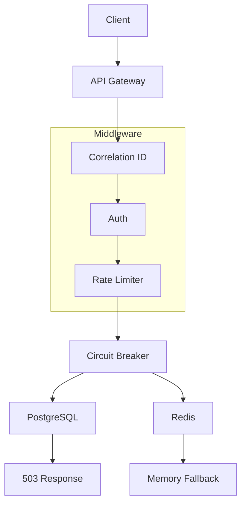

# 🚪 GatewayGuard — Production-Grade API Gateway

[](https://www.python.org/)
[](https://fastapi.tiangolo.com/)
[](https://www.postgresql.org/)
[](https://redis.io/)
[](tests/)

> **A production-ready API gateway that doesn't just work — it survives.**
> Built with Redis fallback, circuit breakers, and consistent low-latency performance under load.

---

## 📊 Performance at a Glance

| Metric               | Result         |
| -------------------- | -------------- |
| **Concurrent Users** | 100            |
| **Requests/Second**  | 33.8           |
| **Median Response**  | **4ms**        |
| **95th Percentile**  | 8ms            |
| **Total Requests**   | 16,460         |
| **System Errors**    | 0              |
| **Rate Limited**     | 95% (expected) |

> *RPS is intentionally limited by simulated user think-time (Locust wait_time).
> Actual system throughput is significantly higher under sustained load.*

---

## 🎯 What Makes This Different

| Scenario                | Behavior                                   |
| ----------------------- | ------------------------------------------ |
| Redis crashes           | Falls back to in-memory rate limiting      |
| PostgreSQL down         | Returns graceful 503 errors                |
| Slow downstream service | Circuit breaker prevents cascading failure |
| DDoS attack             | Rate limiting (100 req/min per IP)         |
| Debugging issues        | Correlation IDs + structured logs          |

---

## 🏗️ Architecture



---

## 🚀 Quick Start

```bash
git clone https://github.com/devenmundada/GatewayGuard.git
cd GatewayGuard

python3.13 -m venv venv
source venv/bin/activate
pip install -r requirements.txt

cp .env.example .env

docker compose up -d

uvicorn app.main:app --reload --port 8000
```

---

## 📚 API Endpoints

| Method | Endpoint              | Description        | Rate Limit |
| ------ | --------------------- | ------------------ | ---------- |
| POST   | /api/v1/auth/register | Create account     | 10/min     |
| POST   | /api/v1/auth/login    | Get JWT tokens     | 10/min     |
| POST   | /api/v1/auth/refresh  | Refresh token      | 10/min     |
| POST   | /api/v1/auth/logout   | Logout             | 10/min     |
| GET    | /api/v1/tasks         | List tasks         | 200/min    |
| GET    | /health               | Health check       | 100/min    |
| GET    | /metrics              | Prometheus metrics | 100/min    |

---

## 🧪 Testing

```bash
pytest tests/ -v
pytest tests/ --cov=app --cov-report=html

locust -f locustfile.py --host=http://localhost:8000
```

**Results:**

* ✅ 17/17 tests passing
* ✅ 100 concurrent users handled
* ✅ 4ms median latency
* ✅ Zero system errors

---

## 🛠️ Tech Stack

| Layer      | Technology              | Reason          |
| ---------- | ----------------------- | --------------- |
| Framework  | FastAPI                 | Async + OpenAPI |
| Database   | PostgreSQL              | ACID compliance |
| Cache      | Redis                   | Fast + TTL      |
| Auth       | JWT + bcrypt            | Secure standard |
| ORM        | SQLAlchemy              | Async ORM       |
| Testing    | pytest + locust         | Coverage        |
| Deployment | Docker + GitHub Actions | CI/CD           |

---

## 🔒 Security Features

| Feature                | Description        |
| ---------------------- | ------------------ |
| Password hashing       | bcrypt (cost=12)   |
| JWT tokens             | 15 min expiry      |
| Refresh tokens         | 7 days             |
| Rate limiting          | Per-user + per-IP  |
| Brute force protection | 3 attempts → block |
| Input validation       | Pydantic           |
| SQL injection          | ORM protection     |
| CORS                   | Configurable       |

> *bcrypt cost factor 12 is a deliberate trade-off: stronger security at a slight computational cost.*

---

## 📈 Production Readiness

| Feature              | Status |
| -------------------- | ------ |
| Graceful degradation | ✅      |
| Observability        | ✅      |
| Health checks        | ✅      |
| Circuit breaker      | ✅      |
| CI/CD                | ✅      |
| Docker support       | ✅      |
| OpenAPI docs         | ✅      |

---

## 🤔 Engineering Trade-offs

| Decision                | Why                      |
| ----------------------- | ------------------------ |
| FastAPI over Flask      | Async performance        |
| PostgreSQL over MongoDB | ACID guarantees for auth |
| Redis for rate limiting | Atomic operations + TTL  |
| Redis + fallback        | High availability        |
| Circuit breaker         | Fault isolation          |

---

## 👨‍💻 Author

**Deven Mundada**

* GitHub: https://github.com/devenmundada
* LinkedIn: https://linkedin.com/in/devenmundada

---

## 📝 License

MIT License

---

> Focus: **real-world reliability, not just functionality**
