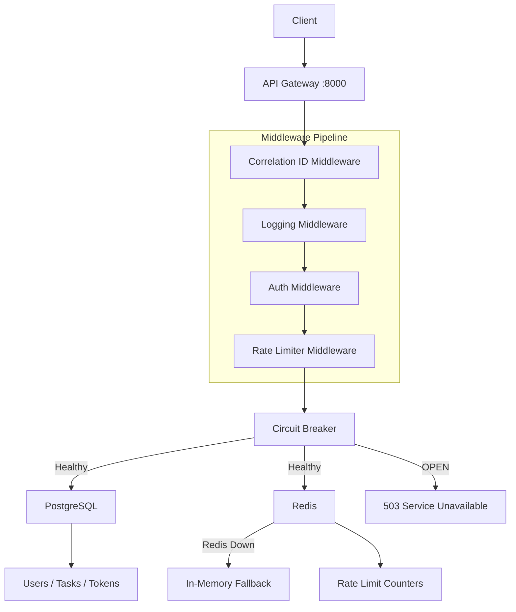

# 🚪 GatewayGuard — Production-Grade API Gateway

[](https://www.python.org/)
[](https://fastapi.tiangolo.com/)
[](https://www.postgresql.org/)
[](https://redis.io/)
[](https://github.com/devenmundada/GatewayGuard/actions)
[](docs/performance.md)
[](LICENSE)

> **A production-ready API gateway that doesn't just work — it survives.**
> Built with Redis fallback, circuit breakers, and consistent low-latency performance under load.

---

## 📖 Table of Contents

- [📊 Performance at a Glance](#-performance-at-a-glance)
- [🎯 What Makes This Different](#-what-makes-this-different)
- [🏗️ Architecture](#️-architecture)
- [🚀 Quick Start](#-quick-start)
- [📚 API Endpoints](#-api-endpoints)
- [🧪 Testing](#-testing)
- [🛠️ Tech Stack](#️-tech-stack)
- [🔒 Security Features](#-security-features)
- [📈 Production Readiness](#-production-readiness)
- [🤔 Engineering Trade-offs](#-engineering-trade-offs)
- [📚 Documentation](#-documentation)
- [👨‍💻 Author](#-author)
- [📝 License](#-license)

---

## 📊 Performance at a Glance

| Metric | Result |
|--------|--------|
| **Concurrent Users** | 100 |
| **Requests/Second** | 33.8 |
| **Median Response** | **4ms** |
| **95th Percentile** | 8ms |
| **99th Percentile** | 12–28ms |
| **Total Requests** | 16,460 |
| **System Errors** | **0** |
| **Rate Limited** | ~95% (expected) |

> *RPS is intentionally limited by simulated user think-time (Locust wait_time). Actual system throughput is significantly higher under sustained load.*

**[📊 Full Performance Analysis →](docs/performance.md)**

---

## 🎯 What Makes This Different

| Scenario | Behavior |
|----------|----------|
| Redis crashes | Falls back to in-memory rate limiting automatically |
| PostgreSQL down | Returns graceful 503 errors |
| Slow downstream service | Circuit breaker prevents cascading failure |
| DDoS attack | Rate limiting (100 req/min per IP) |
| Debugging issues | Correlation IDs + structured JSON logs |

> **This isn't a "happy path" project. It's built to survive failure.**

---

## 🏗️ Architecture



**[📐 Full Architecture Deep Dive →](docs/architecture.md)**

---

## 🚀 Quick Start

```bash
# 1. Clone the repository
git clone https://github.com/devenmundada/GatewayGuard.git
cd GatewayGuard

# 2. Create virtual environment
python3.13 -m venv venv
source venv/bin/activate        # Windows: venv\Scripts\activate

# 3. Install dependencies
pip install -r requirements.txt

# 4. Configure environment
cp .env.example .env            # Edit .env with your settings

# 5. Start PostgreSQL + Redis
docker compose up -d

# 6. Run database migrations
alembic upgrade head

# 7. Start the gateway
uvicorn app.main:app --reload --port 8000
```

| URL | Purpose |
|-----|---------|
| http://localhost:8000 | API Gateway |
| http://localhost:8000/docs | Interactive API Docs (Swagger) |
| http://localhost:8000/metrics | Prometheus Metrics |
| http://localhost:8000/health | Health Check |

**[🛠️ Full Development Guide →](docs/development.md)**

---

## 📚 API Endpoints

| Method | Endpoint | Auth Required | Rate Limit | Description |
|--------|----------|:-------------:|:----------:|-------------|
| `POST` | `/api/v1/auth/register` | ❌ | 10/min | Create account |
| `POST` | `/api/v1/auth/login` | ❌ | 10/min | Get JWT tokens |
| `POST` | `/api/v1/auth/refresh` | ❌ | 10/min | Refresh access token |
| `POST` | `/api/v1/auth/logout` | ✅ | 10/min | Revoke refresh token |
| `GET` | `/api/v1/tasks` | ✅ | 200/min | List user tasks |
| `POST` | `/api/v1/tasks` | ✅ | 200/min | Create a task |
| `GET` | `/health` | ❌ | 100/min | Liveness + readiness |
| `GET` | `/metrics` | ❌ | 100/min | Prometheus metrics |

---

## 🧪 Testing

```bash
# Run all tests
pytest tests/ -v

# With coverage report
pytest tests/ --cov=app --cov-report=html

# Run load tests (open http://localhost:8089 to configure)
locust -f locustfile.py --host=http://localhost:8000
```

### Results

| Test | Result |
|------|--------|
| Unit & Integration Tests | ✅ 17/17 passing |
| Concurrent Users | ✅ 100 |
| Median Latency | ✅ 4ms |
| 95th Percentile | ✅ 8ms |
| System Errors | ✅ 0 |

**[🔬 Full Load Test Analysis →](docs/performance.md)**

---

## 🛠️ Tech Stack

| Layer | Technology | Version | Why |
|-------|-----------|---------|-----|
| Framework | FastAPI | 0.115.0 | Async, auto OpenAPI docs |
| Server | Uvicorn | 0.30.0 | ASGI, multi-worker |
| Database | PostgreSQL | 16 | ACID compliance for auth |
| Cache | Redis | 7 | Atomic ops + TTL |
| ORM | SQLAlchemy | 2.0.35 | Async ORM |
| Auth | python-jose | 3.3.0 | JWT handling |
| Hashing | passlib | 1.7.4 | pbkdf2_sha256 |
| Logging | python-json-logger | 2.0.7 | Structured JSON logs |
| Metrics | prometheus-client | 0.20.0 | Prometheus exposition |
| Testing | pytest + locust | 8.0.0 | Unit, integration, load |
| CI/CD | GitHub Actions | — | Automated pipeline |
| Container | Docker Compose | — | One-command setup |

**[🧩 Full Technology Breakdown →](docs/architecture.md#technology-stack)**

---

## 🔒 Security Features

| Feature | Implementation | Detail |
|---------|---------------|--------|
| Password hashing | pbkdf2_sha256 | Via passlib, no plaintext ever stored |
| Access tokens | JWT (HS256) | 15 min expiry + jti for replay prevention |
| Refresh tokens | DB-stored | 7 days, revocable, single-use rotation |
| Rate limiting | Redis + fallback | Per-user (200/min) and per-IP (100/min) |
| Brute force protection | Auth rate limit | 10 attempts/min → 429 |
| Input validation | Pydantic v2 | All endpoints validated at schema level |
| SQL injection | SQLAlchemy ORM | No raw queries |
| CORS | FastAPI middleware | Configurable per environment |

**[🔐 Full Security Architecture + Threat Model →](docs/security.md)**

---

## 📈 Production Readiness

| Feature | Status | Notes |
|---------|:------:|-------|
| Graceful degradation | ✅ | Redis down → memory fallback |
| Structured observability | ✅ | JSON logs + correlation IDs |
| Health checks | ✅ | Liveness + readiness at /health |
| Circuit breaker | ✅ | CLOSED → OPEN → HALF-OPEN |
| CI/CD pipeline | ✅ | GitHub Actions on every push |
| Docker support | ✅ | docker compose up -d |
| OpenAPI docs | ✅ | Auto-generated at /docs |
| Prometheus metrics | ✅ | Exposed at /metrics |

---

## 🤔 Engineering Trade-offs

| Decision | Chosen | Alternative | Why |
|----------|--------|-------------|-----|
| Web framework | FastAPI | Flask | Native async, 6x faster |
| Database | PostgreSQL | MongoDB | ACID compliance for auth data |
| Rate limit store | Redis | Database | Atomic INCR + TTL, <1ms |
| Rate limit fallback | In-memory dict | Fail open | Graceful degradation |
| Password hashing | pbkdf2_sha256 | bcrypt | No C compiler needed in CI |
| Rate limit algorithm | Fixed window | Sliding window | Simpler, acceptable trade-off |

**[📐 More design decisions →](docs/architecture.md#design-decisions)**

---

## 📚 Documentation

| Document | What's inside |
|----------|--------------|
| [🏗️ Architecture Deep Dive](docs/architecture.md) | System design, middleware pipeline, DB schema, Mermaid diagrams |
| [📊 Performance Analysis](docs/performance.md) | Load test methodology, endpoint breakdown, latency analysis |
| [🚦 Rate Limiting Deep Dive](docs/rate-limiting.md) | Redis fallback mechanism, algorithm trade-offs, failure scenarios |
| [🔒 Security Architecture](docs/security.md) | Auth flow, JWT strategy, threat model, incident response |
| [🗺️ Roadmap](docs/roadmap.md) | v1.0 features, Phase 1–5 improvements, future ideas |
| [🛠️ Development Guide](docs/development.md) | Local setup, migrations, debugging, common issues |
| [🤝 Contributing](CONTRIBUTING.md) | How to contribute, commit format, code standards |
| [🔒 Security Policy](SECURITY.md) | Vulnerability reporting, supported versions |

---

## 👨‍💻 Author

**Deven Mundada**

[](https://github.com/devenmundada)
[](https://linkedin.com/in/devenmundada)

---

## 📝 License

This project is licensed under the MIT License — see the [LICENSE](LICENSE) file for details.

---

## ⭐ Star the Project

If you found this useful, give it a ⭐ — it helps others discover the project!

---

> **Focus: real-world reliability, not just functionality.**
> Built with ❤️ for the HENNGE Global Internship Program and Infosys DSE.
