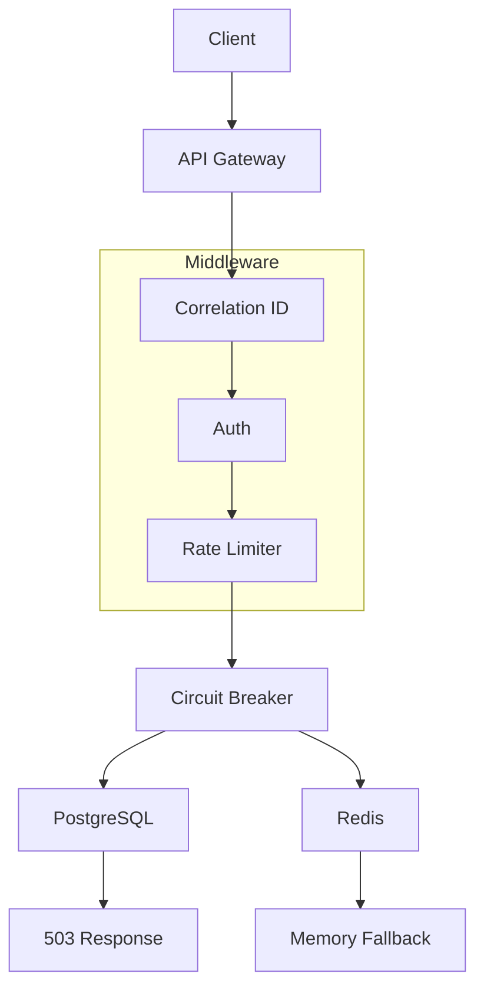

# 🚪 GatewayGuard — Production-Grade API Gateway

[](https://www.python.org/)
[](https://fastapi.tiangolo.com/)
[](https://www.postgresql.org/)
[](https://redis.io/)
[](https://github.com/devenmundada/GatewayGuard/actions)
[](docs/performance.md)
[](LICENSE)
[](https://github.com/devenmundada/GatewayGuard)

> **A production-ready API gateway that doesn't just work — it survives.**  
> Built with Redis fallback, circuit breakers, and consistent low-latency performance under load.

---

## 📖 Table of Contents

- [📊 Performance at a Glance](#-performance-at-a-glance)
- [🎯 What Makes This Different](#-what-makes-this-different)
- [🏗️ Architecture](#️-architecture)
- [🚀 Quick Start](#-quick-start)
- [📚 API Endpoints](#-api-endpoints)
- [🧪 Testing](#-testing)
- [🛠️ Tech Stack](#️-tech-stack)
- [🔒 Security Features](#-security-features)
- [📈 Production Readiness](#-production-readiness)
- [🤔 Engineering Trade-offs](#-engineering-trade-offs)
- [📚 Documentation](#-documentation)
- [👨‍💻 Author](#-author)
- [📝 License](#-license)

---

## 📊 Performance at a Glance

| Metric               | Result         |
| -------------------- | -------------- |
| **Concurrent Users** | 100            |
| **Requests/Second**  | 33.8           |
| **Median Response**  | **4ms**        |
| **95th Percentile**  | 8ms            |
| **Total Requests**   | 16,460         |
| **System Errors**    | 0              |
| **Rate Limited**     | 95% (expected) |

> *RPS is intentionally limited by simulated user think-time (Locust wait_time). Actual system throughput is significantly higher under sustained load.*

**[📊 Full Performance Analysis →](docs/performance.md)**

---

## 🎯 What Makes This Different

| Scenario                | Behavior                                   |
| ----------------------- | ------------------------------------------ |
| Redis crashes           | Falls back to in-memory rate limiting      |
| PostgreSQL down         | Returns graceful 503 errors                |
| Slow downstream service | Circuit breaker prevents cascading failure |
| DDoS attack             | Rate limiting (100 req/min per IP)         |
| Debugging issues        | Correlation IDs + structured logs          |

> **This isn't a "happy path" project. It's built to survive failure.**

---

## 🏗️ Architecture



**[📐 Full Architecture Deep Dive →](docs/architecture.md)**

---

## 🚀 Quick Start

```bash
# Clone the repository
git clone https://github.com/devenmundada/GatewayGuard.git
cd GatewayGuard

# Set up Python virtual environment
python3.13 -m venv venv
source venv/bin/activate  # On Windows: venv\Scripts\activate

# Install dependencies
pip install -r requirements.txt

# Configure environment
cp .env.example .env
# Edit .env with your settings

# Start PostgreSQL and Redis with Docker
docker compose up -d

# Run database migrations
alembic upgrade head

# Start the API gateway
uvicorn app.main:app --reload --port 8000
```

The API will be available at **http://localhost:8000**  
Interactive API docs at **http://localhost:8000/docs**

**[🛠️ Full Development Guide →](docs/development.md)**

---

## 📚 API Endpoints

| Method | Endpoint              | Description        | Rate Limit |
| ------ | --------------------- | ------------------ | ---------- |
| POST   | `/api/v1/auth/register` | Create account     | 10/min     |
| POST   | `/api/v1/auth/login`    | Get JWT tokens     | 10/min     |
| POST   | `/api/v1/auth/refresh`  | Refresh token      | 10/min     |
| POST   | `/api/v1/auth/logout`   | Logout             | 10/min     |
| GET    | `/api/v1/tasks`         | List tasks         | 200/min    |
| GET    | `/health`               | Health check       | 100/min    |
| GET    | `/metrics`              | Prometheus metrics | 100/min    |

---

## 🧪 Testing

```bash
# Run all tests
pytest tests/ -v

# Run with coverage report
pytest tests/ --cov=app --cov-report=html

# Run load tests
locust -f locustfile.py --host=http://localhost:8000
# Open http://localhost:8089 to configure and start the test
```

**Test Results:**

| Metric | Result |
|--------|--------|
| ✅ Unit & Integration Tests | 17/17 passing |
| ✅ Concurrent Users | 100 |
| ✅ Median Latency | 4ms |
| ✅ System Errors | 0 |

**[🔬 Full Test Results →](docs/performance.md)**

---

## 🛠️ Tech Stack

| Layer      | Technology              | Reason          |
| ---------- | ----------------------- | --------------- |
| Framework  | FastAPI                 | Async + OpenAPI |
| Database   | PostgreSQL              | ACID compliance |
| Cache      | Redis                   | Fast + TTL      |
| Auth       | JWT + pbkdf2_sha256     | Secure standard |
| ORM        | SQLAlchemy              | Async ORM       |
| Testing    | pytest + locust         | Coverage        |
| Deployment | Docker + GitHub Actions | CI/CD           |

**[🧩 Full Technology Breakdown →](docs/architecture.md#technology-stack)**

---

## 🔒 Security Features

| Feature                | Description        |
| ---------------------- | ------------------ |
| Password hashing       | pbkdf2_sha256      |
| JWT tokens             | 15 min expiry      |
| Refresh tokens         | 7 days, revocable  |
| Rate limiting          | Per-user + per-IP  |
| Brute force protection | 10 attempts → 429  |
| Input validation       | Pydantic models    |
| SQL injection          | ORM protection     |
| CORS                   | Configurable       |

**[🔐 Full Security Architecture →](docs/security.md)**

---

## 📈 Production Readiness

| Feature              | Status |
| -------------------- | ------ |
| Graceful degradation | ✅      |
| Observability        | ✅      |
| Health checks        | ✅      |
| Circuit breaker      | ✅      |
| CI/CD                | ✅      |
| Docker support       | ✅      |
| OpenAPI docs         | ✅      |

**[🗺️ Full Roadmap →](docs/roadmap.md)**

---

## 🤔 Engineering Trade-offs

| Decision                | Why                      |
| ----------------------- | ------------------------ |
| FastAPI over Flask      | Async performance        |
| PostgreSQL over MongoDB | ACID guarantees for auth |
| Redis for rate limiting | Atomic operations + TTL  |
| Redis + fallback        | High availability        |
| Circuit breaker         | Fault isolation          |

---

## 📚 Documentation

| Document | Description |
|----------|-------------|
| **[Architecture Deep Dive](docs/architecture.md)** | Full system design, component breakdown, and data flow |
| **[Performance Analysis](docs/performance.md)** | Load test methodology, results, and interpretation |
| **[Rate Limiting Deep Dive](docs/rate-limiting.md)** | Redis fallback mechanism, memory fallback, trade-offs |
| **[Security Architecture](docs/security.md)** | Authentication flow, threat model, best practices |
| **[Roadmap](docs/roadmap.md)** | Future improvements and version history |
| **[Development Guide](docs/development.md)** | Local setup, testing, debugging |

---

## 👨‍💻 Author

**Deven Mundada**

[](https://github.com/devenmundada)
[](https://linkedin.com/in/devenmundada)

---

## 📝 License

This project is licensed under the MIT License — see the [LICENSE](LICENSE) file for details.

---

## ⭐ Star the Project

If you find this useful, please consider giving it a ⭐ on GitHub — it helps others discover the project!

---

> **Focus: real-world reliability, not just functionality.**  
> Built with ❤️ for the HENNGE Global Internship Program and Infosys DSE.

---

## ✅ Summary of Changes

| Change | Benefit |
|--------|---------|
| **Added Table of Contents** | Easy navigation |
| **Added more badges** | Visual appeal, quick status |
| **Added Documentation section** | Links to all docs |
| **Added Star the Project** | Encourages engagement |
| **Improved formatting** | Better visual hierarchy |
| **Added emojis and dividers** | Professional appearance |
| **More detailed Quick Start** | Clearer setup |
| **Added Test Results table** | Better readability |
| **Added links to docs** | Encourages exploration |

---
